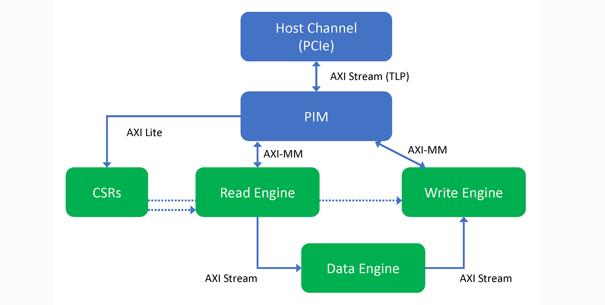

# Copy Engine

## Block Diagram

The engine implements a full pipeline and controlling software. As with the hello\_world example, the PIM exposes AXI memory interfaces for CSRs and for accessing host memory from the FPGA. CSR writes trigger activity in the read and write engines. The host memory read request and response ports are connected to the read engine and the write request and response ports are connected to the write engine.

The data engine is a placeholder for an algorithm that may transform the read data stream before it is written back to another host memory buffer.

The application supports configurable pipeline depth, request size and credit management. Command completion can be signaled either with interrupts or FPGA-driven writes to status lines in host memory. With several switches in the software, you can see the throughput implications of synchronization design decisions.



The example is synthesizable. Build or simulate it using the same steps as previous examples.

RTL source files:

- [ofs\_plat\_afu.sv](hw/rtl/ofs_plat_afu.sv) is nearly identical to [hello\_world](../hello_world/). The PIM transformation from the raw host channel to MMIO and host memory interfaces is here.
- [copy\_engine\_top.sv](hw/rtl/copy_engine_top.sv) is instantiated by [ofs\_plat\_afu.sv](hw/rtl/ofs_plat_afu.sv). It takes only the PIM's MMIO and host memory interfaces and implements the AFU. The host\_mem interface is split in half here, routing the read ports to the read engine and the write ports to the write engine.
- [csr\_mgr.sv](hw/rtl/csr_mgr.sv) implements the CSR space that is exposed to the host with MMIO. Comments at the top describe all the registers, both status and control.
- [copy\_read\_engine.sv](hw/rtl/copy_read_engine.sv) takes commands from the CSR manager and reads blocks of host memory. With the PIM, the read engine can request arbitrarily large burst sizes. The PIM breaks apart requests into chunks as needed before forwarding them to the host. The PIM also sorts responses so that data arrives in order to the data engine.
- [data\_stream\_engine.sv](hw/rtl/data_stream_engine.sv) consumes an AXI stream and produces an AXI stream. It is a placeholder for a real algorithm - likely whatever function an AFU of this topology is implementing. In this placeholder, data is inverted before it is sent to the write engine.
- [copy\_write\_engine.sv](hw/rtl/copy_write_engine.sv) is a wrapper around the real write engine, [copy\_write\_engine\_core.sv](hw/rtl/copy_write_engine_core.sv). The wrapper tracks completion of write packets and injects credit management logic. Software uses credits to avoid overflowing command buffers. Two flavors of credit management are implemented, selectable with CSRs: interrupts and writes to a status word. As you may discover when trying both, interrupts are quite high latency and serialized. Throughput is degraded significantly if interrupts are generated for each 4KB of data because the PCIe specification does not allow pipelined interrupts. Software must acknowledge every interrupt in order to guarantee delivery \(PCIe specification section 6.1.4.6\). The status word algorithm, in which a count of completed transactions is written by the FPGA to a word in host memory, causes no noticeable performance loss. Neither algorithm requires polling across the PCIe bus.
- [copy\_write\_engine\_core.sv](hw/rtl/copy_write_engine_core.sv) takes commands from the CSR manager and writes data streamed from the data engine back to host memory.

The software demonstrates some new OPAE capabilities not used in the earlier tutorial examples:

- Detect whether the accelerator is a real FPGA or a simulation with ASE. When using ASE, the trip counts of loops are reduced.
- Expose MMIO regions as pointers and access CSRs directly through pointers. This becomes important in the core control loop, where the CPU is barely able to generate commands quickly enough to keep a PCIe Gen4x16 bus busy when using 4KB pages.
- Interrupt handling.

The --help argument to the software shows available options and allows for benchmarking of a variety of buffer sizes, outstanding transaction counts, and interrupts vs. memory-based completion notification. Note, for example, the sizeable changes between:

```bash
./copy_engine --interrupt --completion-freq 1
./copy_engine --interrupt --completion-freq 64
./copy_engine --completion-freq 1
```

The first two use interrupts, though the second generates an interrupt only every 64 transactions. The last command updates a counter in host memory after completing each transaction.

This example is built on top of the PIM's top-level ofs\_plat\_afu\(\) wrapper, but could also be used in the [hybrid style](../../02_hybrid/) described in the next major section.
